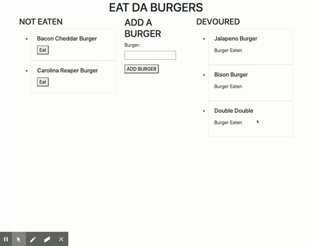
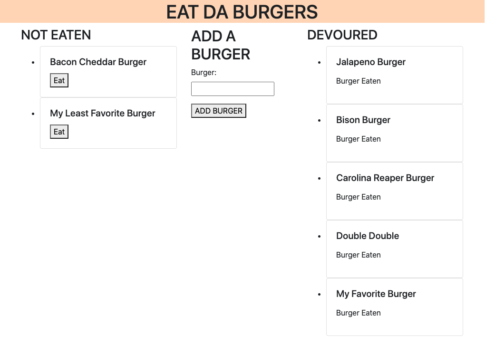

# Burger

## Description

This app is meant to add new burgers to a ul of un-eaten burgers. You may then click a button to eat the burger, effectively moving it to the other side under Devoured. The data is persistent across sessions as they are stored in a SQL database. Further development would allow for deletion of the burgers that have already been devoured.

## Table of Contents 

* [Installation](#installation)

* [Usage](#usage)

* [License](#license)

* [Contributing](#contributing)

* [Tests](#tests)

* [Questions](#questions)

* [Demo](#demo)

* [Screenshot](#screenshot)

## Installation

To install necessary dependencies, run the following command:

`
npm i
`

## Usage

If running on your local machine, you will need to run npm i, have SQL Workbench open, and run npm start to run in localhost.

## License

This project is licensed under GPL-3.0.
  
## Contributing

Anyone.

## Tests

To run tests, run the following command:

`
n/a
`

## Questions

If you have any questions about the repo,please contact me at drfrank22@gmail.com.

## Demo

## Screenshot

